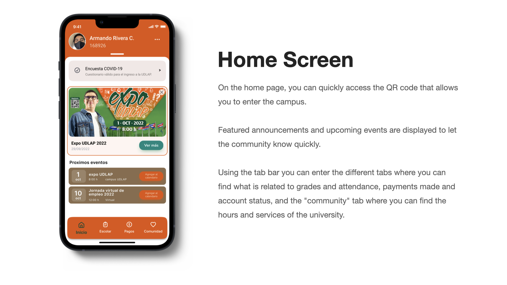
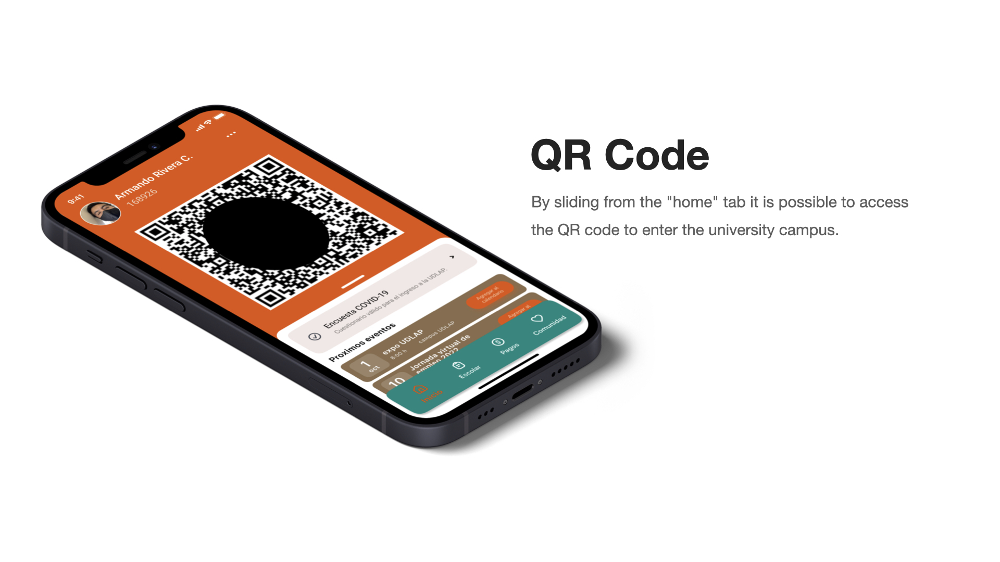
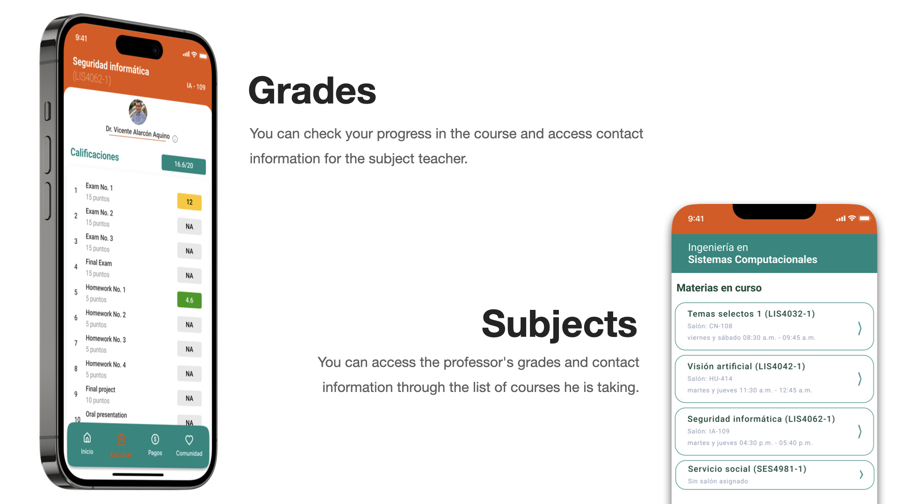

# UI design project
## Mobile app design for the UDLAP life app.

For the UI/UX course I decided to work on the design for the improvement of the existing application 'UDLAP life', a dedicated application for the student community.

For the design of the interfaces, the Figma application was used.

